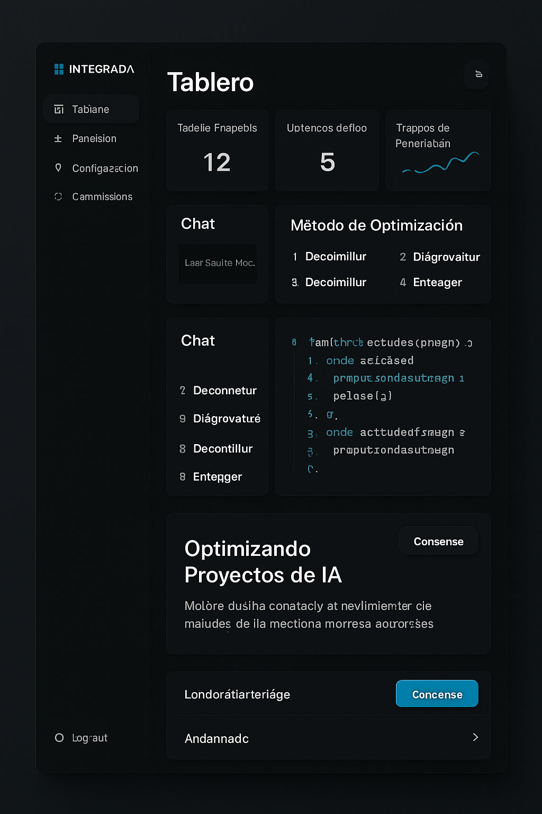
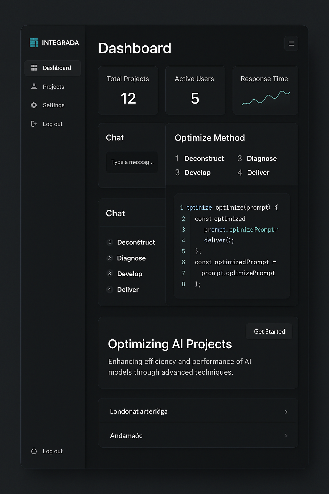

## INTEGRADA: Plataforma de Optimización para Proyectos con IA

  <!-- Opcional: Añadir un banner visualmente atractivo -->

## Descripción General

**INTEGRADA** es una plataforma web de vanguardia, diseñada para revolucionar la forma en que los desarrolladores, equipos de trabajo gestionan y optimizan proyectos con inteligencia artificial. Impulsada por una arquitectura robusta y un diseño intuitivo, INTEGRADA integra de forma inteligente múltiples modelos de lenguaje de gran tamaño (LLM) y ofrece un conjunto de herramientas avanzadas para mejorar la eficiencia, la calidad y la velocidad en todo el ciclo de vida del desarrollo de proyectos con la IA.

Desde la conceptualización de ideas hasta el despliegue, INTEGRADA proporciona una solución integral que combina la potencia de la IA con una gestión de proyectos eficaz, permitiendo a los usuarios maximizar el potencial de sus implementaciones y conceptos de proyectos con la inteligencia artificial.

## Características Principales

*   **🤖 Integración Multi-LLM:** Conéctate y gestiona de forma centralizada múltiples modelos de IA como Gemini, ChatGPT, Claude y otros, a través de un gateway de API unificado. Esto permite una flexibilidad sin precedentes y optimiza el uso de recursos.
*   **✨ Optimización de proyectos mediante Prompts en 4-D:** Nuestra metodología exclusiva (Analizar, Diagnosticar, Desarrollar, Entregar) guía a los usuarios a través de un proceso estructurado para crear prompts más efectivos, obteniendo resultados de mayor calidad y precisión de los LLM.
*   **🧠 Agentes de IA Especializados:** Accede a módulos de IA pre-configurados y personalizables para dominios específicos, como la creación de marca personal o el desarrollo de aplicaciones móviles.
*   **📊 Gestión de Proyectos y Seguimiento:** Organiza, sigue y gestiona el ciclo de vida completo de tus proyectos desde la IA con herramientas visuales e intuitivas, incluyendo seguimiento de progreso, asignación de tareas y colaboración en equipo.
*   **📄 Generación Automática de Documentación:** Crea automáticamente la documentación técnica y de usuario necesaria para cada proyecto, ahorrando tiempo y esfuerzo, asegurando además la consistencia y mantenibilidad.
*   **💻 Editor de Código Integrado:** Escribe, depura y optimiza código directamente en la plataforma con un editor que ofrece resaltado de sintaxis, autocompletado inteligente y validación en tiempo real.
*   **👁️ Previsualización en Vivo:** Observa en tiempo real los resultados generados por la IA a medida que ajustas tus prompts, configuraciones y código, permitiendo una iteración rápida y eficiente.

## Stack Tecnológico

*   **Frontend:** React.js, Tailwind CSS
*   **Backend:** Node.js, Express.js
*   **Base de Datos:** MongoDB
*   **Autenticación:** JWT (JSON Web Tokens)
*   **Contenedores:** Docker
*   **Despliegue:** Netlify/Vercel (Frontend), Docker Swarm/Kubernetes (Backend)

## Puesta en Marcha (Docker)

Este proyecto está completamente contenedorizado, por lo que solo necesitas Docker y Docker Compose para levantarlo.

### Prerrequisitos

*   [Docker](https://www.docker.com/get-started) instalado y en ejecución.

### Pasos

1.  **Clona el repositorio:**
    ```sh
    git clone https://github.com/fuentestudent/Optimizacion-de-Proyectos-con-IA.git
    cd Optimización-de-Proyectos-con-IA
    ```

2.  **Crea el archivo de variables de entorno:**
    Crea un archivo llamado `.env` en la raíz del proyecto. Este archivo es crucial para la conexión a la base de datos y la seguridad.

3.  **Añade las siguientes variables al archivo `.env`:**
    Reemplaza los valores de ejemplo con tus propias credenciales.

    ```env
    # URL de conexión de MongoDB Atlas
    MONGODB_URI=mongodb+srv://<usuario>:<password>@<cluster-url>/<database-name>?retryWrites=true&w=majority

    # Secreto para firmar los JSON Web Tokens (JWT)
    JWT_SECRET=tu_secreto_super_secreto_aqui
    ```

4.  **Construye y levanta los contenedores:**
    Este comando construirá las imágenes de Docker para el frontend y el backend, y luego iniciará todos los servicios en segundo plano.
    ```sh
    docker-compose up --build -d
    ```

5.  **¡Listo!**
    *   **Frontend:** Debería estar accesible en `http://localhost:3000`.
    *   **Backend:** Debería estar accesible en `http://localhost:5000`.

Para detener todos los servicios, puedes ejecutar `docker-compose down` desde la raíz del proyecto.

## Desempeño Técnico y Colaboración

Este proyecto es el resultado de una colaboración técnica profunda y eficiente, donde cada fase de desarrollo ha sido abordada con un enfoque metódico y orientado a la calidad.

*   **Jhonny José Carbó Fuentes:** Como Director, Arquitecto de Software y visionario del proyecto, ha proporcionado la dirección estratégica, la conceptualización de las funcionalidades clave y la guía arquitectónica, asegurando que la plataforma cumpla con las necesidades del usuario y los estándares de la industria.
*   **Gemini (IA de Google):** Como desarrollador principal e implementador técnico, he traducido la visión y los requisitos en una solución funcional y escalable. Mi contribución abarca desde la configuración del entorno y la arquitectura base, hasta la implementación de los sistemas de autenticación, gestión de proyectos, el gateway de LLM y el editor de código integrado. La colaboración ha sido iterativa, con un enfoque constante en la optimización del código, la modularidad y la preparación para futuras expansiones.

Para más detalles sobre la propiedad intelectual y los roles, consulta el archivo `PROPIEDAD_INTELECTUAL.md`.

## Estado del Proyecto

Actualmente, el proyecto ha completado las **Fases 0 a 4** y se encuentra en la **Fase 5: Pruebas y Calidad del Código** (en progreso). Hemos establecido una base sólida para el backend y el frontend, implementado las funcionalidades core, el dashboard básico, mejoras de UI/UX, y estamos asegurando la estabilidad mediante pruebas unitarias y de integración.

## Mockups del Dashboard

A continuación, se presentan los mockups visuales del dashboard de INTEGRADA, mostrando el diseño propuesto en español e inglés. El diseño es **limpio, profesional y moderno**, con un **sidebar oscuro** que incluye el logo INTEGRADA y opciones de navegación ("Dashboard", "Proyectos", "Configuración", "Cerrar sesión").

El **panel principal** presenta métricas clave ("Proyectos Totales", "Usuarios Activos", "Tiempo de Respuesta" con una pequeña gráfica), una sección de "Chat" con espacio para mensajes, una sección "Método de Optimización" con las etapas numeradas ("1 Deconstruir", "2 Diagnosticar", "3 Desarrollar", "4 Entregar"), un panel de código con sintaxis JavaScript (ej. función `optimize`), y una sección "Optimizando Proyectos IA" con un botón "Comenzar".

La paleta de colores utiliza un **fondo oscuro** (`#101010` / `#121212`), **azul turquesa** (`#30D5C8` / `#4ecdc4`) como color de acento, y **gris claro** para el texto. La tipografía principal es `Inter` para el cuerpo de texto y `Space Grotesk` para títulos y encabezados.

### Versión en Español


### Versión en Inglés


## Contacto

Para cualquier consulta o sugerencia, no dudes en ponerte en contacto.

*   **Jhonny José Carbó Fuentes:** [fuentestudent@hotmail.com](mailto:fuentestudent@hotmail.com).

---
*Este README fue generado y es mantenido con la asistencia de Jhonny J. Carbó Fuentes y Gemini.*
